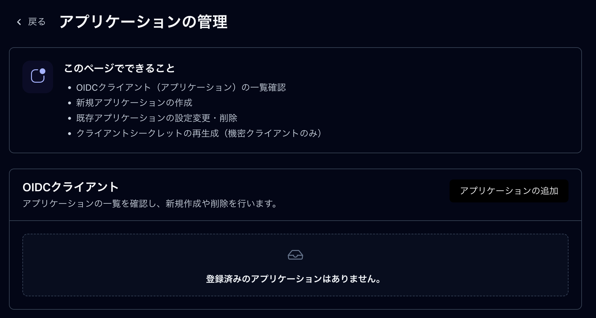
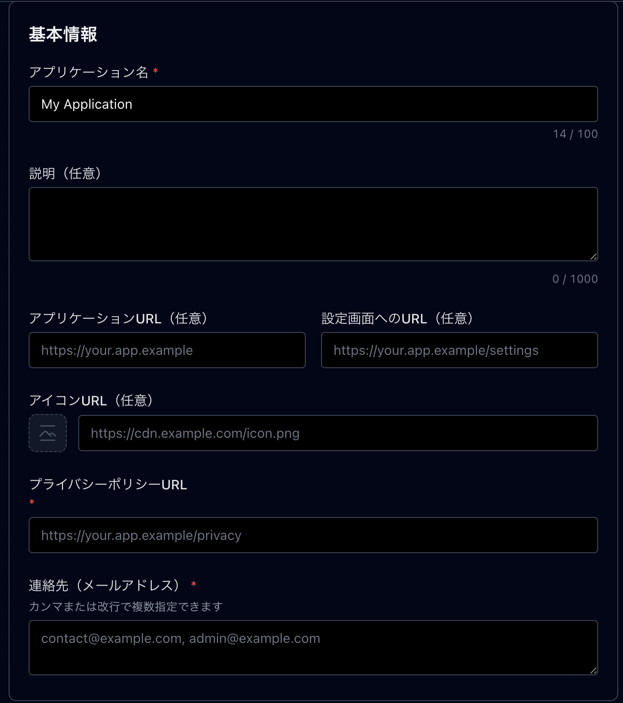
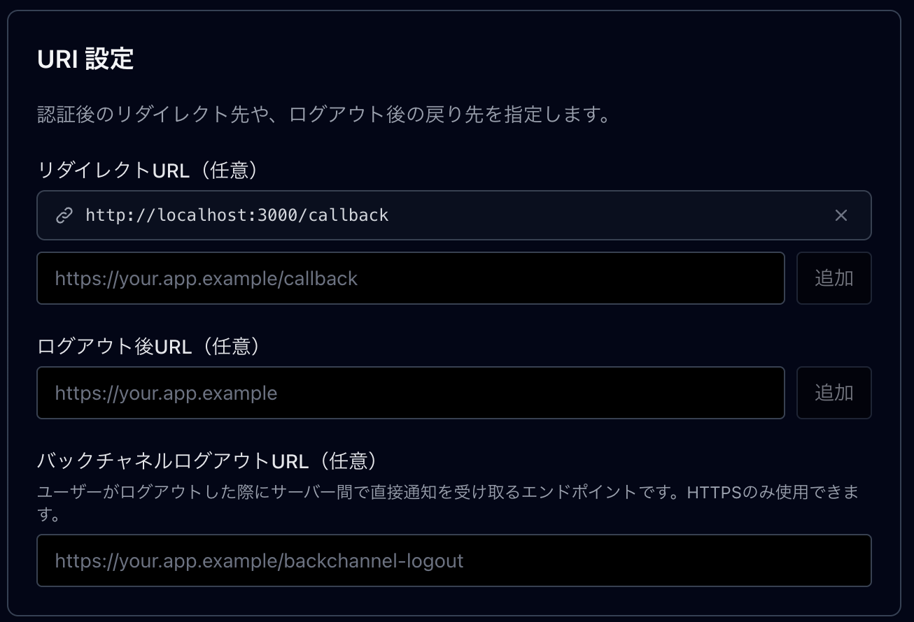
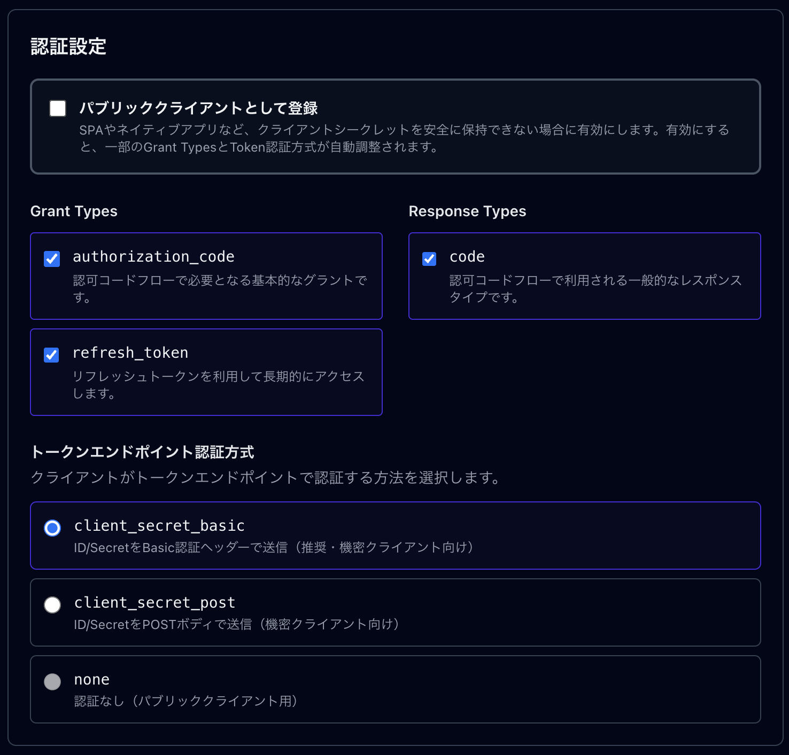
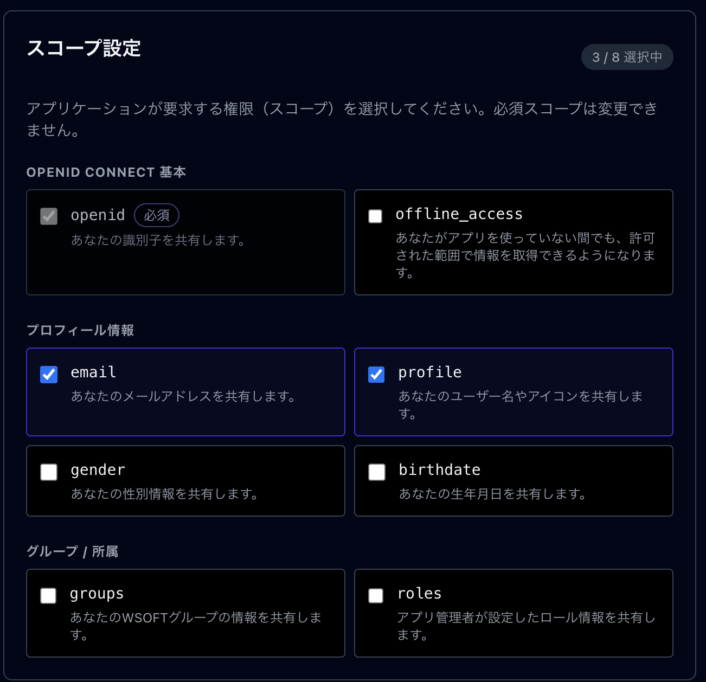

この記事では、WSOFTアカウントにアプリケーションを登録して、アプリケーションにWSOFTアカウントでログインする方法について説明します。この手順は、アプリケーションとWSOFTアカウントとの間に信頼関係を確立するために必要です。

### 前提条件
- アプリケーションの管理者となるWSOFTアカウント
- メールアドレスの検証を済ませている必要があります
- クライアントアプリケーションはOpenID Connectに準拠している必要があります

### アプリケーションを登録する
WSOFTアカウントにアプリケーションを登録すると、アプリケーションはWSOFTアカウントを信頼することになります。

アプリケーションは、次の手順で登録します。

1. [WSOFTアカウントのアプリケーション管理画面](https://accounts.wsoft.ws/settings/developer/applications)を開きます。
2. アプリケーションの管理画面から、「アプリケーションの追加」を選択します。
3. 基本情報を設定します。アプリケーション名、プライバシーポリシー、連絡先の入力は必須です。
4. URIを設定します。リダイレクトURLは、WSOFTアカウントでの認証が完了した後に遷移するURLを指定する必要があります。これは、アプリケーションの設定と同一の必要があります。また、ログアウトURL、バックチャネルログアウトURLも同様です。
5. 認証設定を行います。クライアントアプリケーションの構成に応じて設定が必要です。
6. スコープを設定します。クライアントアプリケーションに必要なスコープをすべて選択してください。使用可能なスコープについては、[IDトークン](./id-token.md)を参照してください。
7. 「登録」を選択してアプリの登録を完了します。このとき、**クライアントIDとクライアントシークレットを控えておく必要**があります。

### アプリケーションの設定を行う
アプリケーションの登録後、使用するクライアントアプリケーションに以下の設定を行います。
これは通常、環境変数や設定画面で設定します。

> [!WARNING]
> クライアントシークレットを公開領域に露出させないでください。不正なユーザーがあなたのアプリケーションになりすましてログインする可能性があります。
> そのような事象が確認された場合、アプリケーションのブロックやアカウントの制限を実施する可能性もあります。

設定項目|設定値
-------|----
OpenID Configuration|`https://accounts.wsoft.ws/.well-known/openid-configuration`
Client ID|アプリケーションのクライアントID
Client Secret|アプリケーションのクライアントシークレット
